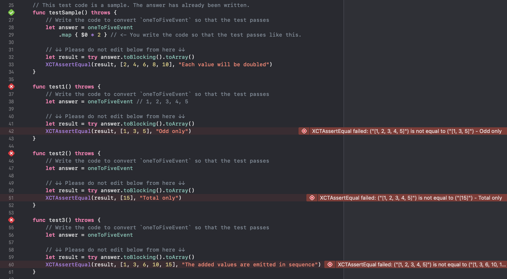

# RxSwiftQuize

There are many tests that fail, so fix them so that they pass.

## How

1. git clone
2. open `RxSwiftQuiz.xcworkspace`
3. write your code
4. Run test

- Test is here: https://github.com/mironal/RxSwiftQuiz/tree/main/RxSwiftQuizTests
- Answer is here: https://github.com/mironal/RxSwiftQuiz/tree/main/Answers

## Any questions?

Create a new issue. Of course, Japanese is fine.

## TODO

- [x] Transforming Observables
  - map, flatMap, scan
- [ ] Combining Observables
  - combineLatest, etc...
- [ ] Error Handling Operators
  - catch, retry
- [ ] Connectable Observable Operators
  - share, reply
- [ ] Creating Observables
  - create
